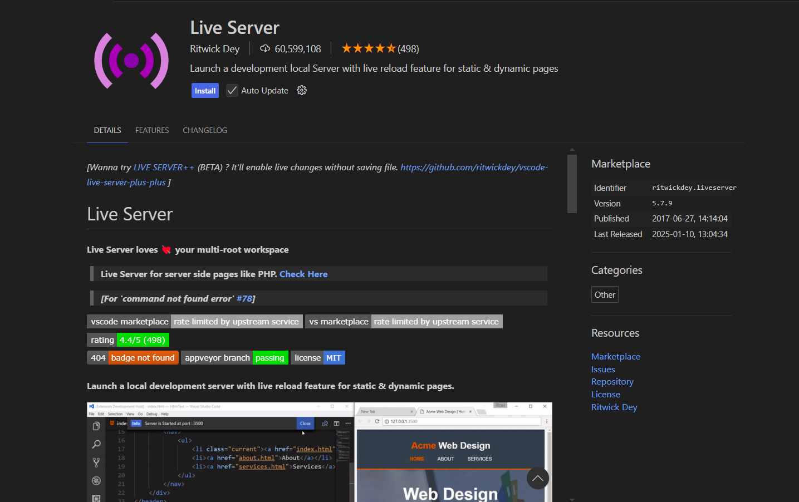
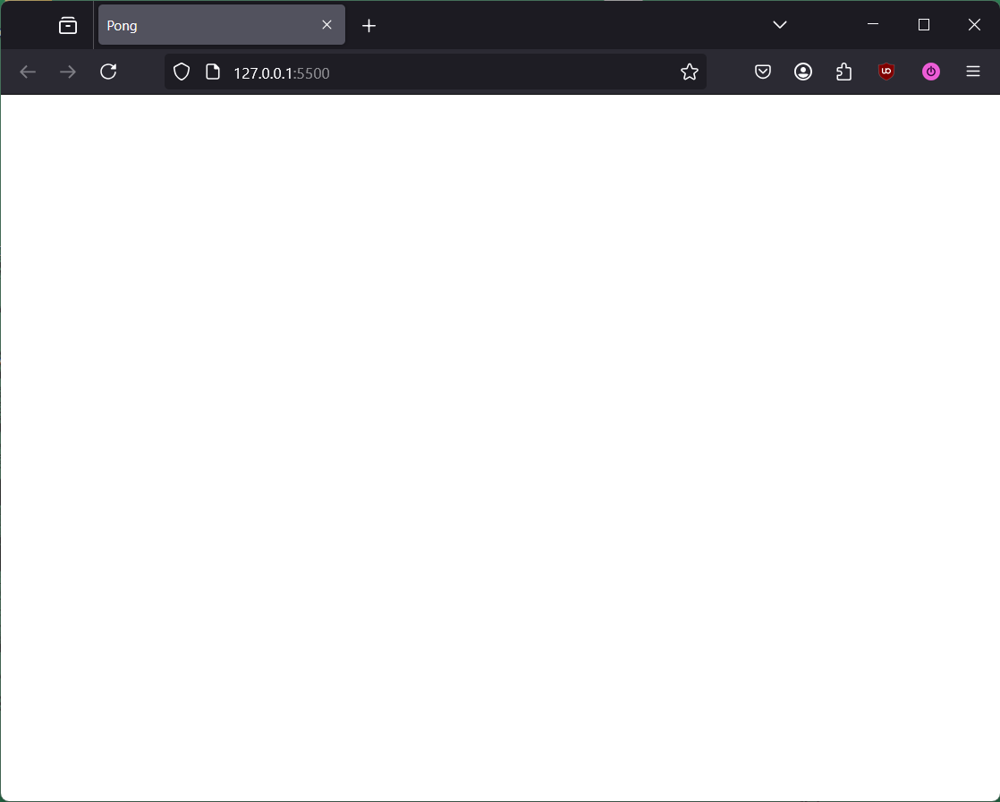

# Setting up a Basic Phaser Project

## Prerequisites
- Know how to run commands in Command Prompt.
- Have VS Code installed.
- Have firefox installed.

## Overview
In this first part of creating a version of Pong using Phaser 3, we will be setting up a basic project with all the starter files ready for development. We will also briefly cover installing and using the *Live Server* extension in VS Code for developing web apps.

## Setting up the Project

1. Navigate to a directory where you want to have your game project stored, e.g. a "Projects" folder or a "Games" folder.

    !!! Info "Note"
        
        The following steps will create a new folder with the game files inside of the directory you navigated into, so there's no need to create a folder for the project itself.

2. Right-click on an empty space in the directory and click **Open Command Prompt** or **Open in Terminal**.
3. With Command Prompt open, copy and paste the following command into it and press Enter:

    $ `git clone https://github.com/ndgeniebla/phaser-pong-starter.git`

    This will create a new directory named `phaser-pong-starter` with all of the starter files inside of it.
    
    !!! Info "What does `git clone` do?"

        `git clone` is a command in `git` that takes a remote repository (i.e. those that are hosted in places like [GitHub](https://github.com/) or [GitLab](https://gitlab.com)) and creates a clone of it on your computer. This command makes it easy to get existing code from the Internet and make modifications to it.

4. Open Visual Studio Code (VS Code).
5. Go to **File > Open Folder** and select the newly created `phaser-pong-starter` folder.
!!! Success "Project Repository"
    The contents of the project directory should look like this once opened in VS Code:
    ```
    |-- phaser-pong-starter           # Root Directory
            |-- assets/               # Game Assets (Storing Sprites and Audio Files)
            |   |-- images            # Sprite Images
            |   |   |-- ball.png       
            |   |   |-- paddle.png    
            |-- src/                  # Source Code
            |   |-- game.js           # Main JavaScript File
            |-- lib/                  # Downloaded Libraries
            |   |-- phaser.d.ts       # Types for Phaser
            |   |-- phaser.min.js     # Minified version of the Phaser 3 Library
            |-- index.html            # Static Web page
    ```
 
## Installing Live Server Extension

!!! Info "Note"

    If you already have the Live Server extension installed, you can skip this section and move onto the next one.

The *Live Server* extension for VS Code is a useful tool that allows web developers to host a static site locally on their computer. When any modifications are made to the web app's code, the live server will automatically refresh, showing your new changes immediately in the browser.

This extension will be very useful when developing the Pong game and other web projects, so we recommend installing it to streamline your workflow as a web developer.


1. With VS Code open, press Ctrl+Shift+X or use the Navigation Bar on the very left to view Extensions.
2. Search for "Live Server" using the search bar at the top.
3. In the search results, click on the *Live Server* extension, authored by Ritwick Dey.

    !!! Success "Correct Extension"

        If the page for the extension matches the image shown below, you have selected the correct *Live Server* extension.

        
    
4. Click on the **Install** button.

!!! Success "Extension Successfully Installed"

    You will know if the *Live Server* extension was installed correctly if you can see the **Go Live** button at the bottom right of your VS Code window.

## Starting the Live Server
With the *Live Server* extension now installed, we can now move onto running our project in the browser.

1. With VS Code still open, navigate back to the Project Explorer by pressing Ctrl+Shift+E or by using the navigation bar on the left side of the window.
2. Click on the **Go Live** button at the bottom right of the VS Code window.

!!! Warning "Viewing the Live Server"

    If a new browser window does not open after clicking **Go Live** button, you should see "Port: XXXX" in place of where the button is, with XXXX being the port number. With this, you can open a browser window and type in `localhost:XXXX' or '127.0.0.1:XXXX' for the URL and you should see the web page for your Phaser app.

!!! Success "Web App Launched"
    The web app is working properly if you see a white page with the heading "Pong using Phaser 3" on it, as seen below:

    

## Conclusion
At the end of this section, you will have done and learned the following:

- Cloned and set up the base project folder to start working on a new Phaser game.
- Installing and running the *Live Server* extension in VS Code for development.

Well done! We can now move to the next step:

**[Creating and Configuring Our Game Instance](02-configuring-creating-game-instance.md)**
