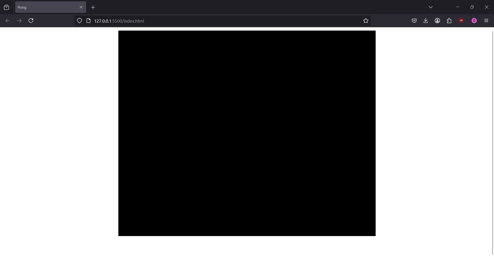

# Pong: Creating and Configuring Our Game Instance

## Prerequisites
1. Have the *Live Server* extension installed on VSCode.
2. Cloned the Git Repository containing the project starter files.

## Overview
In this section of creating Pong, we will cover how to configure a basic Phaser game instance, learn how to create and launch a Phaser game instance, and declaring the functions for a new scene for further development. 

## Configuring the Game Instance
Before creating a Phaser game instance, we have to configure it first. All the options for the configuration can be found inside [Phaser's Official Documentation](https://docs.phaser.io/api-documentation/typedef/types-core#gameconfig), though we will only use a handful of these options in this simple Pong project.

1. With VSCode open, navigate to the **src** folder and open the empty game.js file.
2. At the start of the file, create an empty `config` object:
```JS title="game.js" linenums="1"
const config = {

};
```
3. Add inside of the `config` object the `type` attribute with a value of `Phaser.AUTO`:
```JS title="game.js" linenums="1" hl_lines="2"
const config = {
    type: Phaser.AUTO,
};
```

    1. The `type` attribute tells Phaser to use either [WebGL](https://developer.mozilla.org/en-US/docs/Web/API/WebGL_API) or [Canvas](https://developer.mozilla.org/en-US/docs/Web/API/Canvas_API) to render its graphics. Setting it to `Phaser.AUTO` tells Phaser to use WebGL by default.


4. Add the `parent` attribute to the `config` object with a value of `'game'`:
```JS title="game.js" linenums="1" hl_lines="3"
const config = {
    type: Phaser.AUTO,
    parent: 'game',
};
```

    !!! Warning "Warning"

        Remember to add commas at the end of each key-value pair inside of the `config` object.
    
    The `parent` attribute tells Phaser the HTML ID of the HTML element that the game will be injected into. We will set that up in the next step.

5. Navigate to the root of the directory and open `index.html` in VSCode.

6. Inside of the body tag in the HTML, create a `div` with an ID of `game`, to match the value given to the `parent` attribute in the `config` object:
```HTML title="index.html" linenums="26" hl_lines="4"
<body>
  <h1>Pong using Phaser 3</h1>
  <noscript>You need to enable JavaScript to run this app.</noscript>
  <div id="game"></div>
  <script src="./lib/phaser.min.js"></script>
  <script src="./src/game.js"></script>
</body>
```
Now that Phaser knows where to inject the game in the HTML file, we can go back to configuring our Phaser game.

7. Return to editing the `game.js` file in VSCode.
8. Add the `width` and `height` attributes to the `config` object, with `width` having a value of `800` and the `height` having a value of `640`.
```JS title="game.js" linenums="1" hl_lines="4-5"
const config = {
    type: Phaser.AUTO,
    parent: 'game',
    width: 800,
    height: 640,
};
```
    1. The `width` and `height` attributes define the resolution of the Phaser game when rendered in the browser.

9. Insert the following `scale` object into `config`, with the `mode` and `autoCenter` attributes and their values:
```JS title="game.js" linenums="1" hl_lines="7-10"
const config = {
    type: Phaser.AUTO,
    parent: 'game',
    width: 800,
    height: 640,
    
    scale: {
        mode: Phaser.Scale.RESIZE,
        autoCenter: Phaser.Scale.CENTER_BOTH
    }
};
```
The `scale` object with the given attributes tells Phaser to:

    1. Resize the game screen to fit the space of its parent HTML element, regardless of aspect ratio.
    2. Render the game screen in the center of the window.

    !!! Danger "Phaser Attributes are Case Sensitive"

        All attributes that are part of the `Phaser` object are *case-sensitive*. In this case, the "scale" in `Phaser.Scale` has to start with an uppercase letter. Getting the scale attribute with `Phaser.scale` (scale with a lowercase 's') will *not* work.

10. Insert the `physics` object into `config`, with the `default` and `arcade` attributes and their values:
```JS title="game.js" linenums="1" hl_lines="12-17"
const config = {
    type: Phaser.AUTO,
    parent: 'game',
    width: 800,
    height: 640,
    
    scale: {
        mode: Phaser.Scale.RESIZE,
        autoCenter: Phaser.Scale.CENTER_BOTH
    },
    
    physics: {
        default: 'arcade',
        arcade: {
            gravity: false
        }
    }
};
```
The inserted `physics` object tells Phaser to:

    1. Set the physics engine to Arcade. Other engines include Matter and Impact, but Arcade is the most commonly used.
    2. Sets the Arcade engine's gravity to false, as Pong doesn't use gravity in its gameplay.

## Creating and Starting the Game Instance

After creating the basic configuration for our game, we can now create a Phaser game instance, add our configuration to it, and finally see it run in the browser.

1. Create a new `Phaser.Game` instance by adding the code below, after the `config` object definition:
```JS title="game.js" linenums="1" hl_lines="20"
const config = {
    type: Phaser.AUTO,
    parent: 'game',
    width: 800,
    height: 640,
    
    scale: {
        mode: Phaser.Scale.RESIZE,
        autoCenter: Phaser.Scale.CENTER_BOTH
    },
    
    physics: {
        default: 'arcade',
        arcade: {
            gravity: false
        }
    }
};

const game = new Phaser.Game(config);
```

3. At the bottom-right of the VSCode window, click **Go Live** to start up the live server for the Phaser app.

!!! Success "Success"

    Once the live server has started, you should see a black screen in the center of the browser window. This means that Phaser has properly loaded the game instance.

    
    

## Declaring a Scene
After creating a game instance, now we have to add a *scene* to it. Scenes in Phaser are screens with objects inside of them. A typical game will have multiple scenes with different objects in them.

Since we're only making a simple Pong game, we only need to declare one scene and its associated functions.

1. Insert the `scene` attribute into the `config` object, and declare the `preload`, `create`, and `update` functions inside of it:
```JS title="game.js" linenums="1" hl_lines="12-16"
const config = {
    type: Phaser.AUTO,
    parent: 'game',
    width: 800,
    height: 640,
    
    scale: {
        mode: Phaser.Scale.RESIZE,
        autoCenter: Phaser.Scale.CENTER_BOTH
    },
    
    scene: {
        preload,
        create,
        update
    },
    
    physics: {
        default: 'arcade',
        arcade: {
            gravity: false
        }
    }
}

const game = new Phaser.Game(config);
```

    1. The `preload` function will preload all assets (e.g. images) for the scene.
    2. The `create` function is where we create the sprites for our game entities (i.e. the player paddles and the ball) and set their properties, like their size and physical interactions.
    3. The `update` function runs every single frame while the game is running. This will be used to constantly check the game state and updating it accordingly, like updating the player's paddle coordinates when they hold down a certain key.

2. Declare the `preload`, `create`, `update` functions:
```JS title="game.js" linenums="26" hl_lines="3-13"
const game = new Phaser.Game(config);

function preload() {
    
}

function create() {
    
}

function update() {

}
```

!!! Success "Congratulations! :partying_face:"

    You have now created a basic Phaser app that is now ready to be developed into a simple Pong game.
    ??? Abstract "Starter Code"
        ```JS title="game.js" linenums="1"
        const config = {
            type: Phaser.AUTO,
            parent: 'game',
            width: 800,
            height: 640,
            
            scale: {
                mode: Phaser.Scale.RESIZE,
                autoCenter: Phaser.Scale.CENTER_BOTH
            },
            
            scene: {
                preload,
                create,
                update
            },
            
            physics: {
                default: 'arcade',
                arcade: {
                    gravity: false
                }
            }
        }

        const game = new Phaser.Game(config);
        
        function preload() {
            
        }
        
        function create() {
            
        }
        
        function update() {
            
        }
        ```


## Conclusion
By the end of this section, you will have learned the following:

- How to configure a Phaser game instance
- How to create a Phaser game instance
- How to declare a scene and its functions for further development.

Well done! Now you can move onto the next step:

**[Creating Our First Game Objects and Player Characters](03-creating-game-objects.md)**


