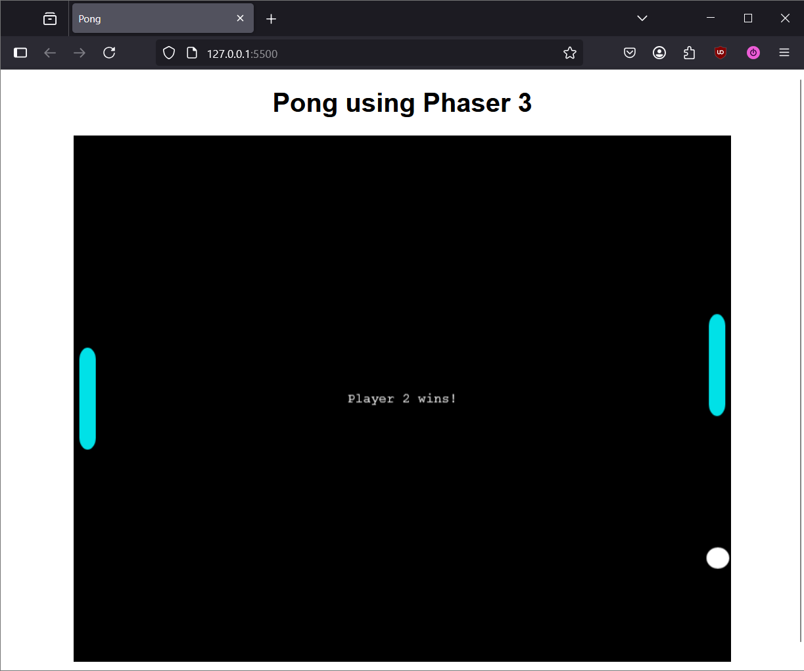

# Pong: Adding Win Conditions, Match Resetting, and Scoring System

## Prerequisites
- Created the player paddles and ball inside of the Phaser scene, and coded their corresponding behaviours/logic.

## Overview
In this final section of creating Pong in Phaser, we will walk through implementing the final features of the game:

- Create a win condition and show a victory screen when a player wins the match.
- The ability to reset the game after a match has finished.
- Keep track of player scores.

## Create a Win Condition
The game in its current state does not properly track if any player has won the match; the ball will simply bounce off the edges of the screen. These instructions will guide you in implementing a win condition, which is met when the ball hits the wall on either player's side.


1. Declare the variables `p1victoryText` and `p2victoryText` in global scope:
```JS title="game.js" linenums="1" hl_lines="11-12"
//...

const game = new Phaser.Game(config);
let ball;
let player1;
let player2;
let isGameStarted = false;
let cursors;
const paddleSpeed = 350;
let keys = {};
let p1victoryText;
let p2victoryText;

//...
```

2. At the bottom of the `create()` function, define `p1victoryText` and `p2victoryText` as text added to the screen:
```JS title="game.js" linenums="1" hl_lines="7-21"
function create() {
    //...

    this.physics.add.collider(ball, player1);
    this.physics.add.collider(ball, player2);
    
    p1victoryText = this.add.text(
        this.physics.world.bounds.width / 2,
        this.physics.world.bounds.height / 2,
        'Player 1 wins!'
    );
    p1victoryText.setVisible(false);
    p1victoryText.setOrigin(0.5);

    p2victoryText = this.add.text(
        this.physics.world.bounds.width / 2,
        this.physics.world.bounds.height / 2,
        'Player 2 wins!'
    );
    p2victoryText.setVisible(false);
    p2victoryText.setOrigin(0.5);
}
```
    
3. In the `update()` function, add the following checks to see which player has won, as well as make the correct victory text appear:
```JS title="game.js" linenums="1" hl_lines="10-20"
function update() {
    if (!isGameStarted) {
        const initialVelocityX = (Math.random() * 150) + 100;
        const initialVelocityY = (Math.random() * 150) + 100;
        ball.setVelocityX(initialVelocityX);
        ball.setVelocityY(initialVelocityY);
        isGameStarted = true;
    }
    
    if (ball.body.x > player1.body.x) {
        p2victoryText.setVisible(true);
        ball.body.setVelocityX(0);
        ball.body.setVelocityY(0);
    }
    
    if (ball.body.x < player2.body.x) {
        p1victoryText.setVisible(true);
        ball.body.setVelocityX(0);
        ball.body.setVelocityY(0);
    }

    //...
}
```

    1. The `if (ball.body.x ...)` conditionals checks if the ball's X coordinate has gone beyond a player's paddle, which determines which player lost the match.
    2. `p1victoryText` and `p2victoryText` are set to visible depending on who lost the match.
    3. The velocity of the ball is set to 0 for both the X and Y coordinates. This freezes the ball in place when the win condition is met.

!!! Success "Proper Win Condition"

    You should now see victory text appear in the middle of the screen when a player wins the match.

    
    
!!! Info "Note"

    Player 2 in this case is actually the player on the left side, and Player 1 is on the right.

## Match Resetting
Currently, when a player wins a match, the victory screen will appear, but it will stay stuck in that state with no way to reset. The only way to play another match in this case is to refresh the web page.

Having to refresh the page every time we want to play another round of Pong can get annoying. The following instructions will walk you through implementing a reset feature, where we can easily start a new match after one has ended by pressing Spacebar.


1. In the `create()` function, add the Spacebar as a valid key in the game:
```JS title="game.js" linenums="1" hl_lines="7"
function create() {
    //...

    cursors = this.input.keyboard.createCursorKeys();
    keys.w = this.input.keyboard.addKey(Phaser.Input.Keyboard.KeyCodes.W);
    keys.s = this.input.keyboard.addKey(Phaser.Input.Keyboard.KeyCodes.S);
    keys.space = this.input.keyboard.addKey(Phaser.Input.Keyboard.KeyCodes.SPACE);
    
    //...
}
```
2. In the `update()` function, add the following code under the `if (!isGameStarted)` conditional:
```JS title="game.js" linenums="1" hl_lines="3-4"
function update() {
    if (!isGameStarted) {
        ball.body.x = this.physics.world.bounds.width / 2;
        ball.body.y = this.physics.world.bounds.height / 2;
        const initialVelocityX = (Math.random() * 150) + 100;
        const initialVelocityY = (Math.random() * 150) + 100;
        ball.setVelocityX(initialVelocityX);
        ball.setVelocityY(initialVelocityY);
        isGameStarted = true;
    }
    
    //...
}
```

    1. This puts the ball back in the center of the game screen when the match is restarted.
    
3. In the `update()` function, add a conditional that will reset the game when the match has ended and if the Spacebar is pressed:
```JS title="game.js" linenums="1" hl_lines="24-30"
function update() {
    if (!isGameStarted) {
        ball.body.x = this.physics.world.bounds.width / 2;
        ball.body.y = this.physics.world.bounds.height / 2;
        const initialVelocityX = (Math.random() * 150) + 100;
        const initialVelocityY = (Math.random() * 150) + 100;
        ball.setVelocityX(initialVelocityX);
        ball.setVelocityY(initialVelocityY);
        isGameStarted = true;
    }
    
    if (ball.body.x > player1.body.x) {
        p2victoryText.setVisible(true);
        ball.body.setVelocityX(0);
        ball.body.setVelocityY(0);
    }
    
    if (ball.body.x < player2.body.x) {
        p1victoryText.setVisible(true);
        ball.body.setVelocityX(0);
        ball.body.setVelocityY(0);
    }

    if (ball.body.x < player2.body.x || ball.body.x > player1.body.x) {
        if (keys.space.isDown) {
            isGameStarted = false;
            p1victoryText.setVisible(false);
            p2victoryText.setVisible(false);
        }
    }
    
    //...
}
```

    1. The `if (... || ...)` conditional checks if either player has won the match. Only if this is true is when the game checks if the Spacebar was pressed.
    2. Setting the `isGameStarted` boolean back to false will put the game in the same state when it is first launched.

## Scoring System
Now that the game properly checks who won a match and matches can be reset by pressing Spacebar, the only thing that is left is to create a scoring system.

1. Declare the variables that will be used to track and display the score in global scope:
```JS title="game.js" linenums="26" hl_lines="11-14"
const game = new Phaser.Game(config);
let ball;
let player1;
let player2;
let isGameStarted = false;
let cursors;
const paddleSpeed = 350;
let keys = {};
let p1victoryText;
let p2victoryText;
let scoreAdded = false;
let scoreText;
let p1Score = 0;
let p2Score = 0;
```

2. In the `create()` function, define `scoreText` as text added to the screen:
```JS title="game.js" linenums="1" hl_lines="20-25"
function create() {
    //...

    p1victoryText = this.add.text(
        this.physics.world.bounds.width / 2,
        this.physics.world.bounds.height / 2,
        'Player 1 wins!'
    );
    p1victoryText.setVisible(false);
    p1victoryText.setOrigin(0.5);

    p2victoryText = this.add.text(
        this.physics.world.bounds.width / 2,
        this.physics.world.bounds.height / 2,
        'Player 2 wins!'
    );
    p2victoryText.setVisible(false);
    p2victoryText.setOrigin(0.5);
    
    scoreText = this.add.text(
        this.physics.world.bounds.width / 2,
        30,
        `${p2Score} : ${p1Score}`
    );
    scoreText.setOrigin(0.5);
}
```

3. In the `update()` function, add logic which will increment the player's score in both win condition checks:
```JS title="game.js" linenums="103" hl_lines="13-16 23-26"
function update() {
    if (!isGameStarted) {
        ball.body.x = this.physics.world.bounds.width / 2;
        ball.body.y = this.physics.world.bounds.height / 2;
        const initialVelocityX = (Math.random() * 150) + 100;
        const initialVelocityY = (Math.random() * 150) + 100;
        ball.setVelocityX(initialVelocityX);
        ball.setVelocityY(initialVelocityY);
        isGameStarted = true;
    }
    
    if (ball.body.x > player1.body.x) {
        if (!scoreAdded) {
            p2Score++;
            scoreAdded = true;
        }
        p2victoryText.setVisible(true);
        ball.body.setVelocityX(0);
        ball.body.setVelocityY(0);
    }
    
    if (ball.body.x < player2.body.x) {
        if (!scoreAdded) {
            p1Score++;
            scoreAdded = true;
        }
        p1victoryText.setVisible(true);
        ball.body.setVelocityX(0);
        ball.body.setVelocityY(0);
    }
    
    //...
}
```

    !!! Info "Why have the `scoreAdded` boolean?"
    
        The extra check for `scoreAdded` is necessary because Phaser calls the `update()` function on every frame that the game renders. If this extra check isn't done, the `p1Score` and `p2Score` variables will increment by one on every single frame instead of only when the player scores.
        
        So if the game runs at 60 frames per second, then `p1score` and `p2score` would end up incrementing by one 60 times a second, which is not what we want.


4. In the `update()` function, set the `scoreAdded` boolean to `false` when the game is reset with Spacebar:
```JS title="game.js" linenums="1" hl_lines="25"
function update() {
    if (ball.body.x > player1.body.x) {
        if (!scoreAdded) {
            p2Score++;
            scoreAdded = true;
        }
        p2victoryText.setVisible(true);
        ball.body.setVelocityX(0);
        ball.body.setVelocityY(0);
    }
    
    if (ball.body.x < player2.body.x) {
        if (!scoreAdded) {
            p1Score++;
            scoreAdded = true;
        }
        p1victoryText.setVisible(true);
        ball.body.setVelocityX(0);
        ball.body.setVelocityY(0);
    }

    if (ball.body.x < player2.body.x || ball.body.x > player1.body.x) {
        if (keys.space.isDown) {
            isGameStarted = false;
            scoreAdded = false;
            p1victoryText.setVisible(false);
            p2victoryText.setVisible(false);
        }
    }
    
    //...
}
```

5. In the `update()` function, set the scores on the game screen to match the players' current scores:
```JS title="game.js" linenums="1" hl_lines="11"
function update() {
    if (ball.body.x < player2.body.x || ball.body.x > player1.body.x) {
        if (keys.space.isDown) {
            isGameStarted = false;
            scoreAdded = false;
            p1victoryText.setVisible(false);
            p2victoryText.setVisible(false);
        }
    }

    scoreText.setText(`${p2Score} : ${p1Score}`)
    
    //...
}
```

!!! Success "Completed Phaser Game"
    Congratulations! You have successfully created a simple Pong game using Phaser 3.
    
    The full working code is available below to reference if you experienced any issues while going through the instructions.
    ??? Abstract "Final Code"
        ```JS title="game.js" linenums="1"
        const config = {
            type: Phaser.AUTO,
            parent: 'game',
            width: 800,
            height: 640,
        
            scale: {
                mode: Phaser.Scale.RESIZE,
                autoCenter: Phaser.Scale.CENTER_BOTH
            },
        
            scene: {
                preload,
                create,
                update
            },
        
            physics: {
                default: 'arcade',
                arcade: {
                    gravity: false
                }
            }
        }
        
        const game = new Phaser.Game(config);
        let ball;
        let player1;
        let player2;
        let isGameStarted = false;
        let cursors;
        const paddleSpeed = 350;
        let keys = {};
        let p1victoryText;
        let p2victoryText;
        let scoreAdded = false;
        let p1Score = 0;
        let p2Score = 0;
        
        function preload() {
            this.load.image("ball", "assets/images/ball.png");
            this.load.image("paddle", "assets/images/paddle.png");
        }
        
        function create() {
            ball = this.physics.add.sprite(
                this.physics.world.bounds.width / 2,
                this.physics.world.bounds.height / 2,
                'ball'
            );
            ball.setCollideWorldBounds(true);
        
            ball.setBounce(1, 1);
        
            player1 = this.physics.add.sprite(
                this.physics.world.bounds.width - (ball.body.width / 2 + 1),
                this.physics.world.bounds.height / 2,
                'paddle'
            );
            player1.setImmovable(true);
            player1.setCollideWorldBounds(true);
        
            player2 = this.physics.add.sprite(
                ball.body.width / 2 + 1,
                this.physics.world.bounds.height / 2,
                'paddle'
            );
            player2.setImmovable(true);
            player2.setCollideWorldBounds(true);
            
            cursors = this.input.keyboard.createCursorKeys();
            keys.w = this.input.keyboard.addKey(Phaser.Input.Keyboard.KeyCodes.W);
            keys.s = this.input.keyboard.addKey(Phaser.Input.Keyboard.KeyCodes.S);
            keys.space = this.input.keyboard.addKey(Phaser.Input.Keyboard.KeyCodes.SPACE);
            
            this.physics.add.collider(ball, player1);
            this.physics.add.collider(ball, player2);
            
            p1victoryText = this.add.text(
                this.physics.world.bounds.width / 2,
                this.physics.world.bounds.height / 2,
                'Player 1 wins!'
            );
            p1victoryText.setVisible(false);
            p1victoryText.setOrigin(0.5);
        
            p2victoryText = this.add.text(
                this.physics.world.bounds.width / 2,
                this.physics.world.bounds.height / 2,
                'Player 2 wins!'
            );
            p2victoryText.setVisible(false);
            p2victoryText.setOrigin(0.5);
            
            scoreText = this.add.text(
                this.physics.world.bounds.width / 2,
                30,
                `${p2Score} : ${p1Score}`
            );
            scoreText.setOrigin(0.5);
        }
        
        function update() {
            if (!isGameStarted) {
                ball.body.x = this.physics.world.bounds.width / 2;
                ball.body.y = this.physics.world.bounds.height / 2;
                const initialVelocityX = (Math.random() * 150) + 100;
                const initialVelocityY = (Math.random() * 150) + 100;
                ball.setVelocityX(initialVelocityX);
                ball.setVelocityY(initialVelocityY);
                isGameStarted = true;
            }
            
            if (ball.body.x > player1.body.x) {
                if (!scoreAdded) {
                    p2Score++;
                    scoreAdded = true;
                }
                p2victoryText.setVisible(true);
                ball.body.setVelocityX(0);
                ball.body.setVelocityY(0);
            }
            
            if (ball.body.x < player2.body.x) {
                if (!scoreAdded) {
                    p1Score++;
                    scoreAdded = true;
                }
                p1victoryText.setVisible(true);
                ball.body.setVelocityX(0);
                ball.body.setVelocityY(0);
            }
        
            if (ball.body.x < player2.body.x || ball.body.x > player1.body.x) {
                if (keys.space.isDown) {
                    isGameStarted = false;
                    scoreAdded = false;
                    p1victoryText.setVisible(false);
                    p2victoryText.setVisible(false);
                }
            }
        
            scoreText.setText(`${p2Score} : ${p1Score}`);
        
            
            player1.body.setVelocityY(0);
            player2.body.setVelocityY(0);
            if (cursors.up.isDown) {
                player1.body.setVelocityY(-paddleSpeed);
            }
            if (cursors.down.isDown) {
                player1.body.setVelocityY(paddleSpeed);
            }
            if (keys.w.isDown) {
                player2.body.setVelocityY(-paddleSpeed);
            }
            if (keys.s.isDown) {
                player2.body.setVelocityY(paddleSpeed);
            }
            
            
            if (ball.body.velocity.y > paddleSpeed) {
                ball.body.setVelocityY(paddleSpeed);
            }
            if (ball.body.velocity.y < -paddleSpeed) {
                ball.body.setVelocityY(-paddleSpeed);
            }
        
        }
        ```


## Conclusion
At the end of this section, you will have learned the following:

- Creating a win condition by adding conditionals inside of the `update()` function.
- Adding and displaying `text` objects to the game screen.
- Resetting the game's state through a keybind (i.e. Spacebar).
- Tracking scores and displaying them on the screen.

Well done! You have completed all of the parts of creating Pong using the Phaser 3 library! :partying_face: