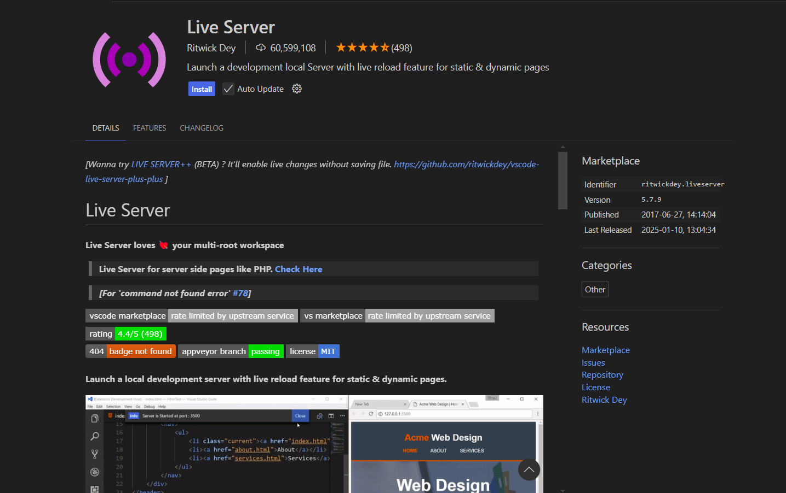
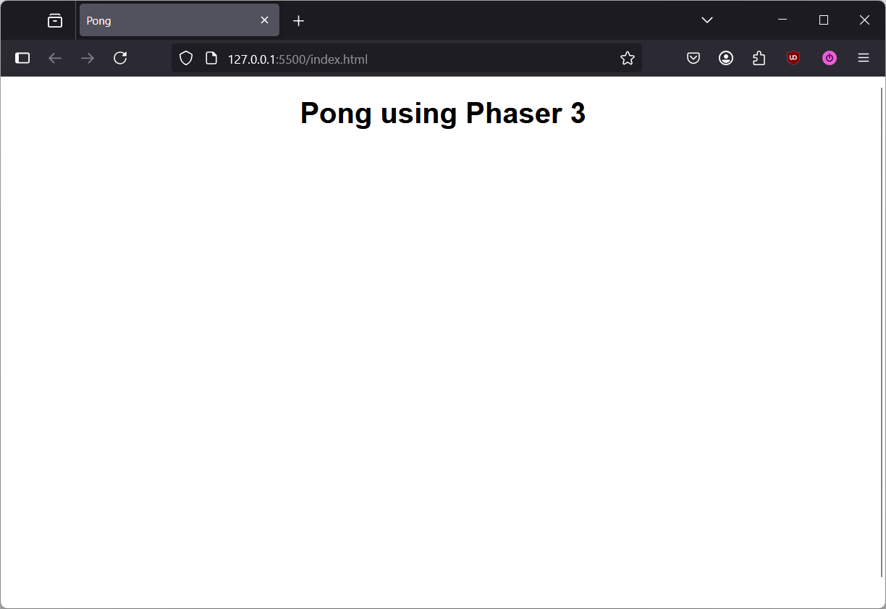

# Setting up a Basic Phaser Project

## Prerequisites
- Have basic knowledge of the git clone command (literally just running the thing)

## Overview
- Installing Live Server
- Phaser 3
- add details of what the expected result should be
    - at the end you should get a starter project with all the necessary files and libraries to start on your Phaser Project

## Setting up the Project

1. Navigate to a directory where you want to have your game project stored, e.g. a **Projects** folder or a **Games** folder.

    !!! Info "Note"
        
        The following steps will create a new folder with the game files inside of the directory you navigated into, so there's no need to create a folder for the project itself.

2. Right-click on an empty space in the directory and click **Open Command Prompt**.
3. With Command Prompt open, copy and paste the following command into it and press Enter:

    `$ git clone https://github.com/ndgeniebla/phaser-pong-starter.git`

    This will create a new directory named `phaser-pong-starter` with all of the starter files inside of it.

4. Open Visual Studio Code (VS Code).
5. Go to **File > Open Folder** and select the newly created `phaser-pong-starter` folder.
    - Now you should see VS Code like this, with the project open and the following project structure: (show image)
 
## Installing Live Server Extension

The *Live Server* extension for VS Code is a useful tool that allows web developers to host a static site locally on their computer. When any modifications are made to the web app's code, the live server will automatically refresh, showing your new changes immediately in the browser.

This extension will be very useful when developing the Pong game and other web projects, so we recommend installing it to streamline your workflow as a web developer.

!!! Info "Note"

    If you already have the Live Server extension installed, you can skip this section and move onto the next one.

1. With VS Code open, press Ctrl+Shift+X or use the Navigation Bar on the very left to view Extensions.
2. Search for "Live Server" using the search bar at the top.
3. In the search results, click on the *Live Server* extension, authored by Ritwick Dey.

    !!! Success "Correct Extension"

        If the page for the extension matches the image shown below, you have selected the correct *Live Server* extension.

        
    
4. Click on the **Install** button.

!!! Success "Extension Successfully Installed"

    You will know if the *Live Server* extension was installed correctly if you can see the **Go Live** button at the bottom right of your VS Code window.

## Starting the Live Server
With the *Live Server* extension now installed, we can now move onto running our project in the browser.

1. With VS Code still open, navigate back to the Project Explorer by pressing Ctrl+Shift+E or by using the navigation bar on the left side of the window.
2. Click on the **Go Live** button at the bottom right of the VS Code window.

!!! Warning "Viewing the Live Server"

    If a new browser window does not open after clicking **Go Live** button, you should see "Port: XXXX" in place of where the button is, with XXXX being the port number. With this, you can open a browser window and type in `localhost:XXXX' and you should see the web page for your Phaser app.

!!! Success "Web App Launched"
    The web app is working properly if you see a blank white page with "Pong" as the title of the tab, as seen below:

    

## Conclusion

Congratulations!